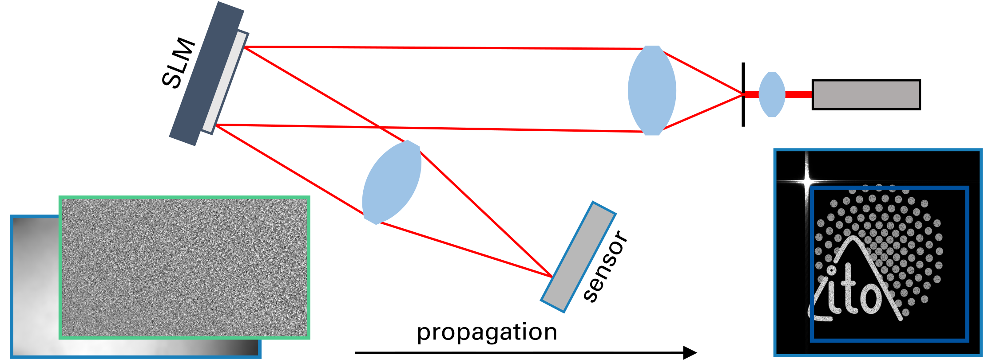
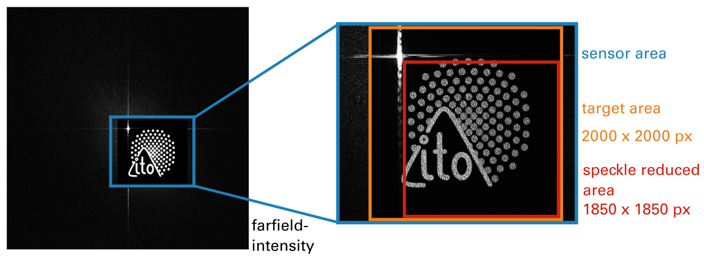

# speckle-reduced-far-field-hologram-tilted-plane
Stochasic-Gradient-Descent sheme for far-field holograms with a Method to propagate to tilted planes and reduce Speckle in a target area

This repository contains the scripts associated with the Digital Optical Technologies 2025 Proceeding "Improved far field holograms using spatial light modulators and camera-in-the-loop optimization"

## 
This Code was used in a Camera-in-the-loop calibration scheme as it was proposed by [Peng et al.](https://github.com/computational-imaging/neural-holography)

We have added two new methods, the code for which is published here:
- a simple Speckle Reduction method
- propagation and calibration for tilted planes using non-uniform FFTs as described by [Chang et al.](https://opg.optica.org/abstract.cfm?URI=oe-22-14-17331)

## 
This code requires TensorFlow >= 2.16

With some changes in the PropagateFarFieldLayer-class TensorFlow 2.9 also works.


* ```model_optical_system.py``` contains all the code to model a simple optical system (as described in the paper) containing a Spatial-Light-Modulator and a potentially tilted sensor in the far field.
* ```SGD_SpeckleReduction.py``` contains the method to find the Speckle in the target area and compute a loss function to reduce the Speckle succesfully.

Intensity in the far field


Sketch of the optical setup



Target Area in the far field with Speckle Reduction in the target area



## Citation
If you find our work useful in your research, please cite:

```
@article{Zimmermann:2025:Improved,
author = {M. Zimmermann, A. Brenner, T. Haist, S. Reichelt},
title = {Improved far field holograms using spatial light modulators and camera-in-the-loop optimization },
journal = {},
issue = {},
number = {},
year = {2025},
}
```
